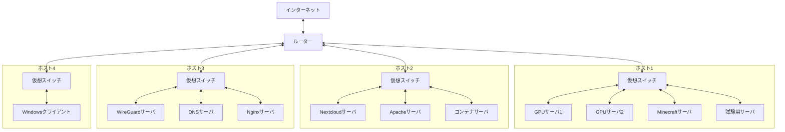
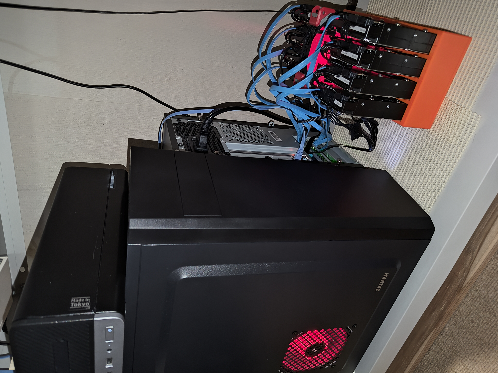
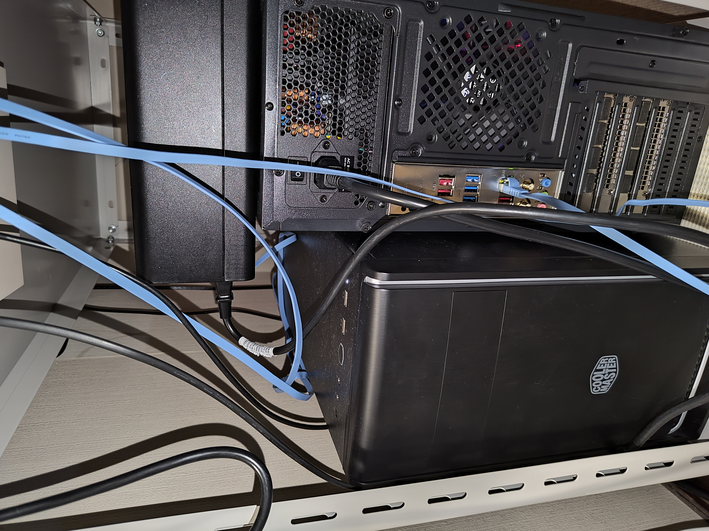
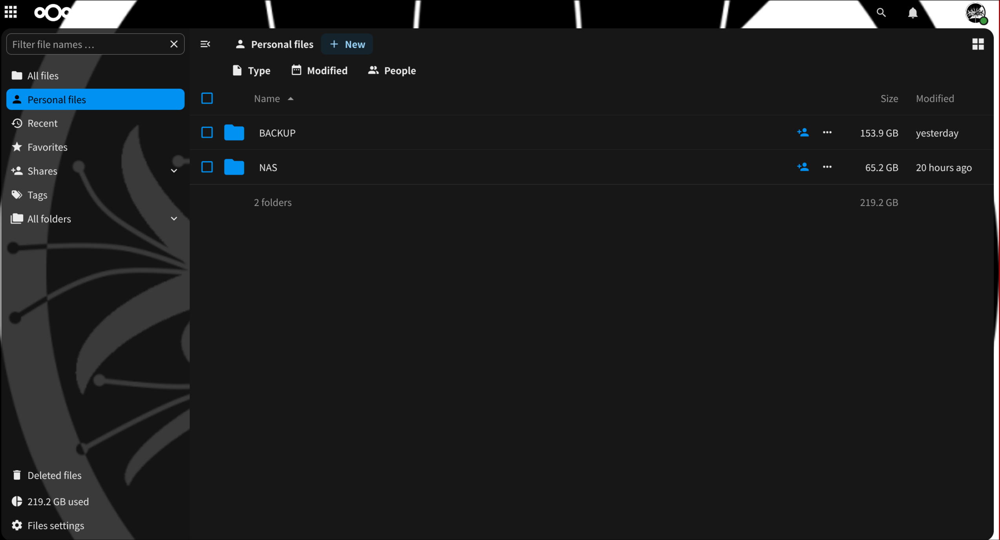
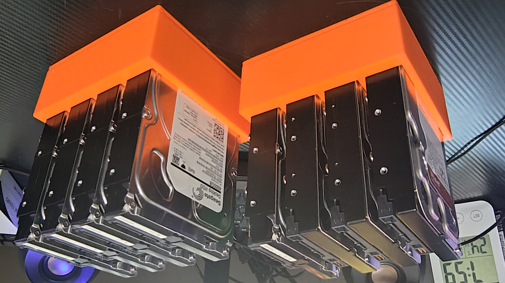
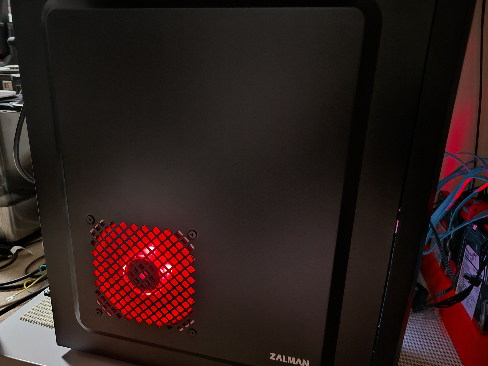

# Proxmoxでつくる快適
# お家リージョンのすゝめ
## MCC部長 upiscium

---
transition: fade
layout: image-right
image: ./images/logo.png
---

# 自己紹介

## upiscium

- 東京農工大学 学部3年
- MCC 部長

- 趣味
  - プログラミング
  - サーバー構築
  - ゲーム(Minecraft)
  - 音楽鑑賞(VOCALOID, クラシック)
- Github: @upiscium
- Twitter: @upiscium

---
transition: fade
layout: center
---

# 突然ですが

# <p1>Proxmox</p1>を知っていますか？

---
transition: fade
layout: image-right
image: ./images/proxmox-top.png
---

# <p1>Proxmoxとは</p1>

### オープンソースの
### 仮想化プラットフォーム

 

### <p2>特徴</p2>
- 複数サーバをnodeとして統合管理できる
- VMをGUIで簡単に管理できる
- KVMとLXCが使える

 
 

# <p3>とにかく楽しい！！！</p3>
# <p3>ぜひ触ってほしい！</p3>

---
transition: fade
layout: center
---

# 本題の<p1>お家リージョン</p1>紹介

---
transition: fade
---

# 物理サーバ構成

- 物理サーバを4台運用中

それぞれのスペックは以下の通り

| <p1>サーバ名</p1> | <p1>CPU</p1> | <p1>RAM</p1> | <p1>ストレージ</p1> | <p1>GPU</p1> |
| --- | --- | --- | --- | --- |
| Gabriel | Ryzen 7 8700G (16コア) | 128GB | 1TB | NVIDIA GeForce RTX 3060 x2 |
| Metatron | Intel Core i3-7100 (4コア) | 40GB | 128GB | - |
| Raphael | Ryzen 7 5700G (8コア) | 32GB | 512GB | - |
| Zadkiel | Intel Core i9-13900KF (32コア) | 128GB | 1TB | NVIDIA GeForce RTX 4080 |
| Total | 68コア | 328GB | 2.64TB | 3GPU |

---
transition: fade
---

# 全体構成

→ 仮想マシン: 9台 / LXC: 2台 を稼働中

 

<p1>

### 構成のポイント

- WireGuardを使った自前VPNホスティング
- DNSサーバによるローカル名前解決
- Nginxを使ったリバースプロキシ

</p1>

---
transition: fade
layout: center
---

# ここからは実際に運用している
# <p1>主要サービス</p1>を紹介します

---
transition: fade
---

# 主要サービス紹介(1)

<p1>

### WireGuardサーバ
- 外からでも安全にアクセスできる(TailScaleで良いとか言わない)
- KDE Connectがどんなネットワークでも使える

</p1>

 

<p1>

### DNSサーバ
- いちいちIPアドレスを覚えなくて良い

</p1>

- ホスト名でサービスにアクセスできる(ホスト名がサービス名で無いのはご愛嬌)

 

<p1>

### Nginxサーバ
- 煩雑なポート番号を気にしなくて良い!
- あのサービスのポート何だっけ? からの解放

</p1>

 

※ 実は全部同一ホストで稼働中 → このホストが落ちるとインフラが逝ってしまう素晴らしい仕様.
 
　こんなに大事なホストなのに中古PCとかいう意味不明な構成

---
transition: fade
---

# 主要サービス紹介(2)

<p1>

### Nextcloudサーバ
- 自前のクラウドストレージで何でも共有できる
- 画像や動画, ドキュメントの共有も簡単
- 4TBストレージで何でも入れられるからとてもハッピー
- これが無いと何もできない

</p1>

 

<p1>

### GPUサーバ
- RTX3060を1枚ずつ別VMに割り当て
- OllamaでローカルLLMを稼働中
- Stable Diffusionで画像生成もする予定

※ RTX4080はWindowsでゲームする用

</p1>

---
transition: fade
layout: center
---

# <p1>お家リージョン</p1>のメリット

---
transition: fade
layout: image-right
image: ./images/proxmox-top.png
---

## 好き放題できる
- 自分のサーバだから何でもできる
- メモリやストレージを気にせず使える
- ハードからソフトまで全部好きにできる

 

## 勉強になる
- サーバ構築やネットワークの勉強になる
- Linuxの知識が身につく
- セキュリティや運用の知識も得られる

 

## コストが安い(要出典)
- 初期投資が必要になる  
→ 買ってしまえば維持費だけ
- クラウドサービスの料金を気にしなくて良い
- 自宅運用だから維持費は電気代のみ

---
transition: fade
layout: center
---

# ここで実際に運用しているサービスを<p1>実演</p1>します！

---
transition: fade
layout: center
---

# 何よりも一番のメリットは<p1>楽しい</p1>こと!
# <p1>Proxmox</p1>を使って<p1>お家リージョン</p1>を作ろう！

---
transition: fade
layout: center
---

# ご清聴ありがとうございました！

